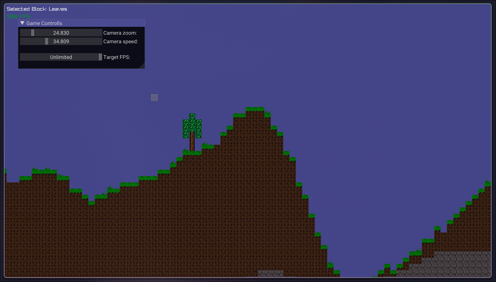

# Terraria Clone (Learning Game Dev)

A 2D sandbox game inspired by Terraria, built in C++ using Raylib.  
This project focuses on learning core game development concepts such as procedural world generation, rendering, and basic engine design.

---

## 📸 Showcase



---

## ✨ Features

- [x] Procedural terrain generation using noise  
- [x] Block placing and breaking system  
- [x] Grass growth system (decoration pass)  
- [x] Camera controls  
- [x] FPS control via ImGui slider (supports uncapped mode)  
- [x] Basic block selection system  

---

## 🎮 Controls

- `Space` → Select next block  
- `R` → Select previous block  
- `Mouse Left Click` → Break block  
- `Mouse Right Click` → Place block  
- `W / A / S / D` → Move camera

---

## 🛠️ Tech Stack

- **C++**
- **Raylib** 
- **ImGui** (gui controls)
- **rlImgui** (raylib imgui backend)
- **FastNoiseSIMD**

---

## 🚀 Getting Started

```bash
git clone https://github.com/akryptic/TerrariaClone.git
cd TerrariaClone
mkdir build && cd build

cmake ..
cmake --build . --parallel $(nproc)

./terraria-clone
```